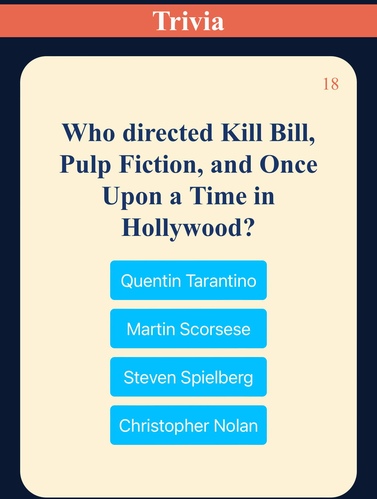

## Project Title

Movie Trivia Game
A simple movie themed trivia game. 
Lasting about 5 of so rounds

## Technologies Used:
Using JavaScript, HTML, CSS.

## Overview:
It's a trivia game. Players answer a series of movie-related questions, randomly picked from a predefined sets. The game tracks the player's score and progress through different questions. At the end of the game, players are presented with their final score and the option to play again. 

## User Stories:

As a user, I want the ability to... 

- Click responsive buttons
- A sound alert
- A clean ui
- random question
- multiplayer option
- a question timer
- themes and catergories

## Wireframes / Screenshots

## Psuedocode

- Set up game. 
- Create game questions
- create game anwsers 
- create Array of gameQuestions 
- Each Question contains the question text,
- possible answers, and the correct answer.
- function to start game
- reset handler 
- function for showing question
- function for showing awnsers
- event listeners for the buttons
- create buttons
- end game screen

## Planned Future Enhancements:

- Track score
- Add a hard mode 
- Add second category 
- sign in option so players can keep track of score. 
- Add animations

